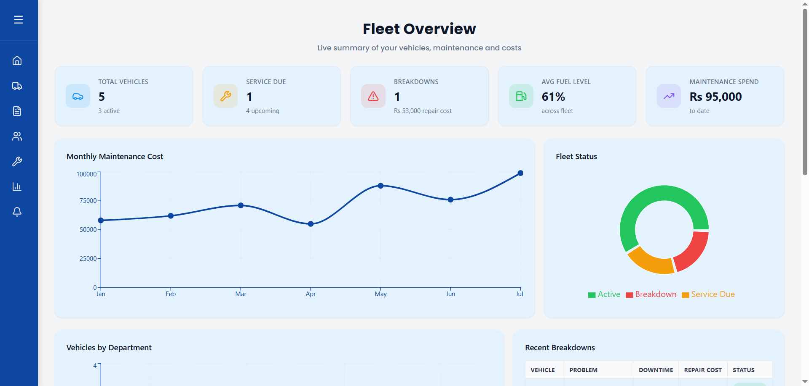
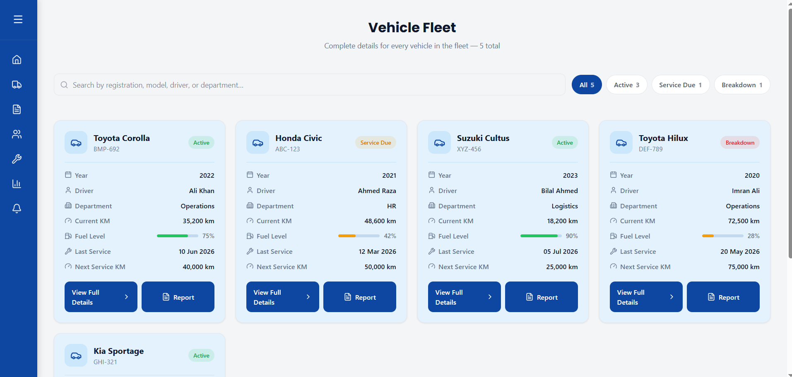
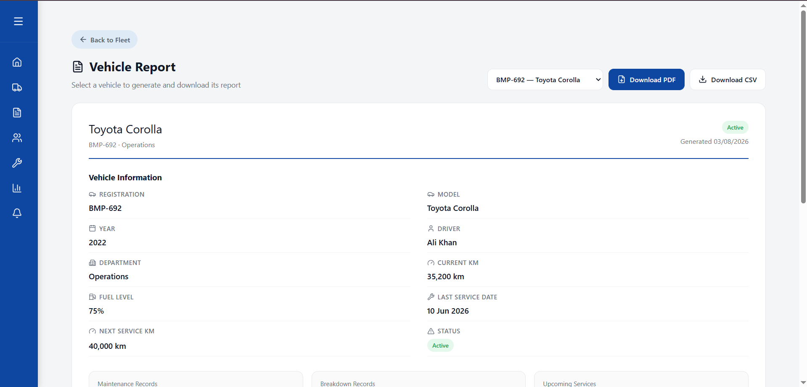
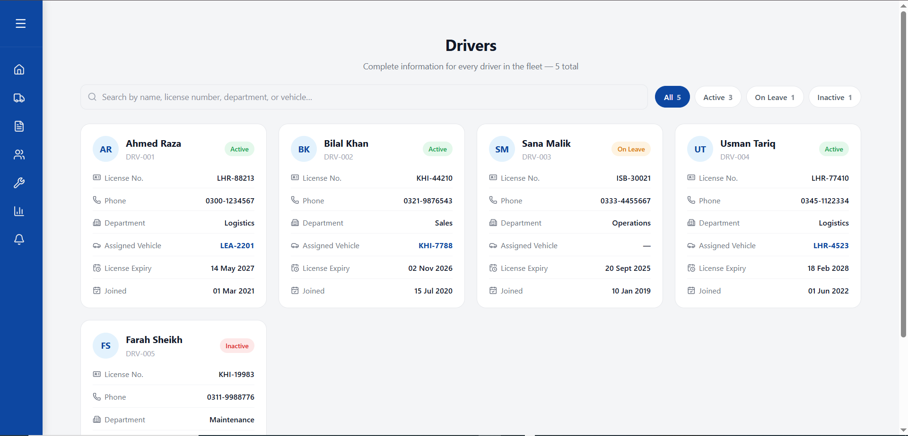
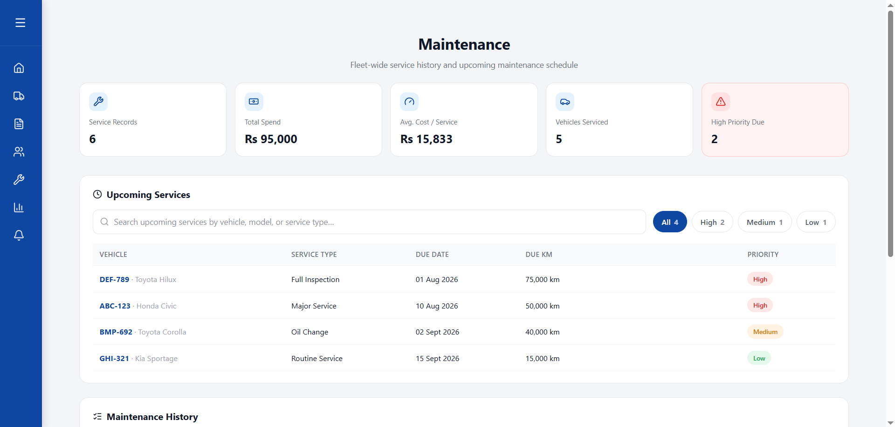
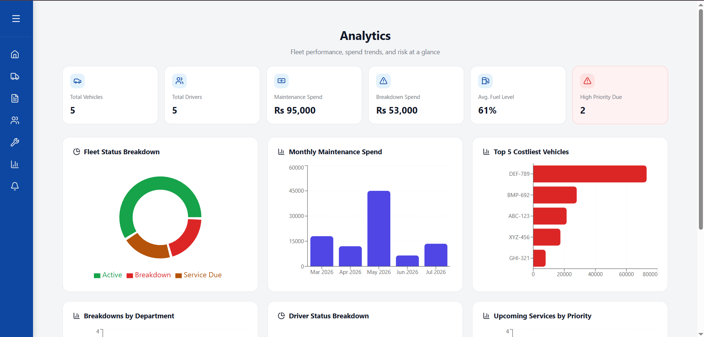
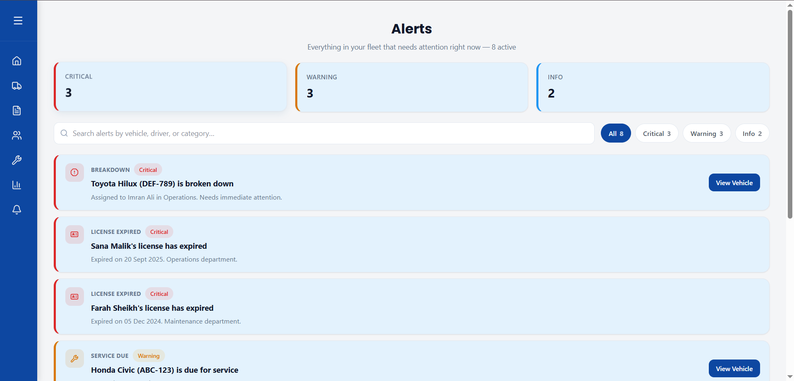
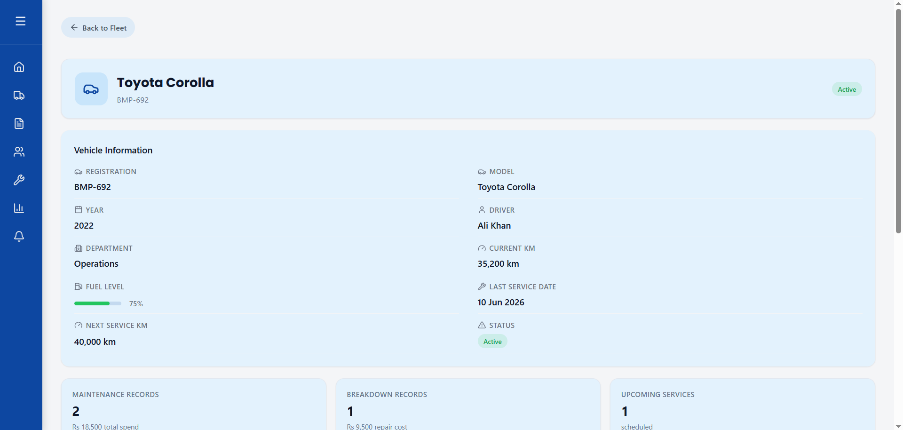

# 🚚 Fleet Management Dashboard

<p align="center">
  A modern, responsive Fleet Management Dashboard built with <strong>React</strong>, <strong>TypeScript</strong>, and <strong>Tailwind CSS</strong>.
</p>

# Overview:

Fleet Management Dashboard is a modern and responsive admin dashboard designed to streamline fleet operations. It provides an intuitive interface for monitoring vehicles, managing drivers, viewing analytics, tracking maintenance, and generating reports.

# Project Demo:
<br>

<a href="https://www.youtube.com/watch?v=ZbDDHFKk1RY">
  
</a>

## Home Page:

<p align="center">
  
</p>

---

## Vehicles Page:

<p align="center">
  
</p>

---

## Reports Page:

<p align="center">
  
</p>

---

## Drivers Page:

<p align="center">
  
</p>

---

## Maintenance Page:

<p align="center">
  
</p>

---

## Analytics Page:

<p align="center">
  
</p>

---

## Alerts Page:

<p align="center">
  
</p>

---

## Vehicle Details Page:

<p align="center">
  
</p>

---

### Highlights:

- Interactive analytics dashboard
- Vehicle tracking and management
- Driver management
- Maintenance monitoring
- Reports and insights
- Fully responsive design
- Fast performance with Vite

---

# Features:

- Interactive Dashboard
- Fleet Overview
- Vehicle Management
- Driver Information
- Statistics Cards
- Reports Section
- Alerts Management
- Fully Responsive Layout
- Built with React & TypeScript
- Modern UI with Tailwind CSS

---

# Tech Stack:

| Technology | Purpose |
|------------|---------|
| React | Frontend Framework |
| TypeScript | Static Type Checking |
| Tailwind CSS | Styling |
| Vite | Build Tool |

---

# Getting Started:

### Clone the repository

```bash
git clone https://github.com/syeda-hira-batool/fleet-management.git
```

### Navigate to the project

```bash
cd fleet-management/fleet-management-dashboard
```

### Install dependencies

```bash
npm install
```

### Start the development server

```bash
npm run dev
```

### Build for production

```bash
npm run build
```

---

# Future Improvements:

- User Authentication
- Dark Mode
- Live GPS Tracking
- Real-time Notifications
- Maintenance Scheduling
- Advanced Analytics
- Export Reports
- Backend Integration

---

# Author:

**Syeda Hira Batool**

- GitHub: https://github.com/syeda-hira-batool
- LinkedIn: https://www.linkedin.com/feed/update/urn:li:activity:7496253630057222144/

---
